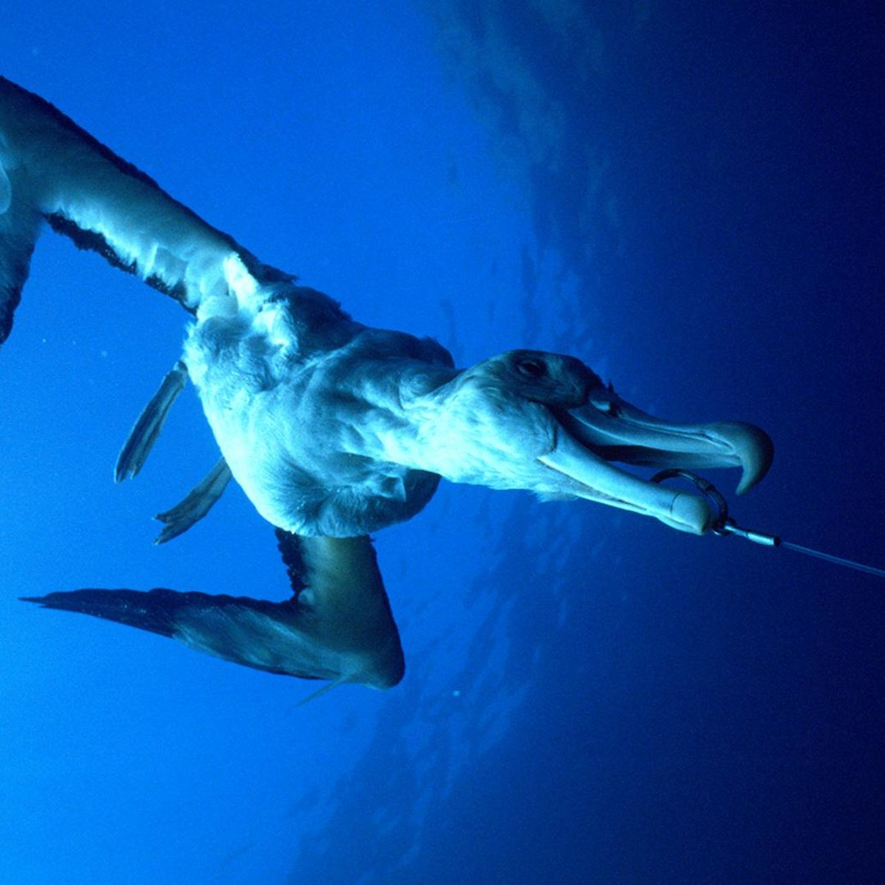

# The CCSBT southern hemisphere seabird risk assessment 

The Spatially Explicit Fisheries Risk Assessment (SEFRA) framework has been developed to estimate the risk to mega-fauna bycatch from fishing.  
